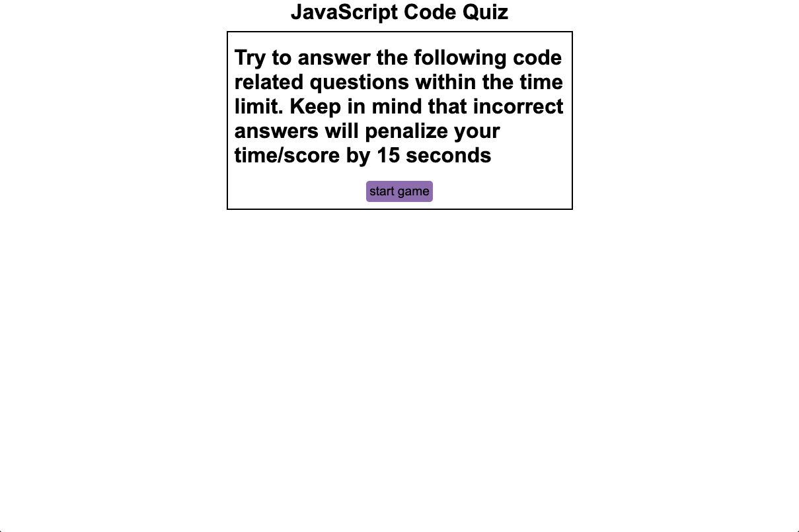

# JavaScript Code Quiz

## Link to live site
[javaScript Code Quiz](https://kokkonut.github.io/Random-Password-Generator/)

## Link to REPO
[Repo here](https://github.com/Kokkonut/The-JS-code-quiz)


## Instalation
None

## Notes
You are viewing Ver2 of this project.

The initial version used more HTML than I would have liked so rebuild was in order.

currently most of the content is generated via JS, its not the most efficient, but for the sake of learning I wanted to give it go.

Due to time constraints I wasnt able to do this with the HiScores page.

## Issues
No access to hi scores from splash page.

Display issue during quiz, cant work out what is going on with appended divs.

Clear hiScores and goBack buttons have moved to the top of the hiScores page.


## My Task

At some point in your journey to become a full-stack web developer, you’ll likely be asked to complete a coding assessment&mdash;perhaps as part of an interview process. A typical coding assessment includes both multiple-choice questions and interactive coding challenges. 

To help familiarize you with these tests and allow you to use the skills covered in this module, this Challenge invites you to build a timed coding quiz with multiple-choice questions. This app will run in the browser and will feature dynamically updated HTML and CSS powered by JavaScript code that you write. It will have a clean, polished, and responsive user interface. 

This week’s coursework will equip you with all the skills you need to succeed in this assignment.

## User Story

```
AS A coding boot camp student
I WANT to take a timed quiz on JavaScript fundamentals that stores high scores
SO THAT I can gauge my progress compared to my peers
```

## Acceptance Criteria

```
GIVEN I am taking a code quiz
WHEN I click the start button
THEN a timer starts and I am presented with a question
WHEN I answer a question
THEN I am presented with another question
WHEN I answer a question incorrectly
THEN time is subtracted from the clock
WHEN all questions are answered or the timer reaches 0
THEN the game is over
WHEN the game is over
THEN I can save my initials and my score
```


## Screenshot of project

